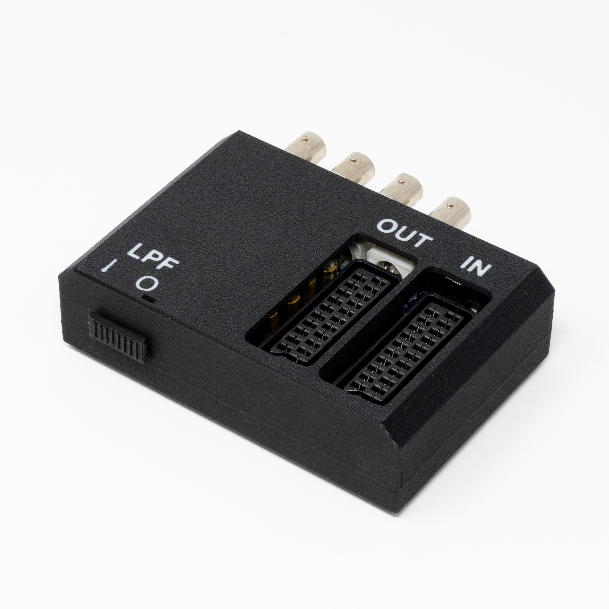

# SCART to BNC &amp; SCART Audio Video Splitter
Split your RGBs signal from your retro console, ideal for connecting to both an upscaler such as the RetroTink and a PVM.

Input: 1x [SCART]
Outputs: 1x [SCART] and 1x [4 BNC + 3.5mm Audio]

## Files Included
- **PCB Design Files** (DipTrace, Gerber)
- **3D Print Files** (STEP, STL, 3MF for Bambu Studio)
- **Bill of Materials** (XLSX)
- **Photos**

## Additional Parts Required
- [12VDC Power Supply](https://amzn.to/4gwsgEL)
- [8x M3x10 Screws](https://amzn.to/40SFHc6)

## Revision History
- PCB v1.1 - Initial Release
- Shell Rev3 - Initial Release

## License
This project is open-source under the [CC BY 4.0 (Attribution 4.0 International)](https://creativecommons.org/licenses/by/4.0/).

## Disclaimer
This project is provided "as-is" without any warranty, express or implied, including but not limited to warranties of merchantability or fitness for a particular purpose. No support is provided.

Amazon links are affiliates.